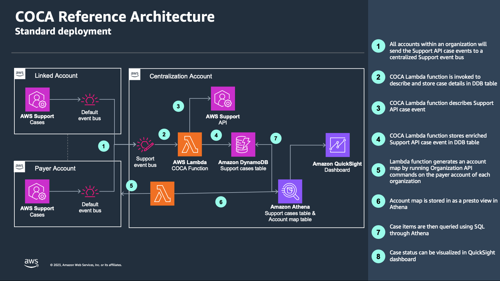
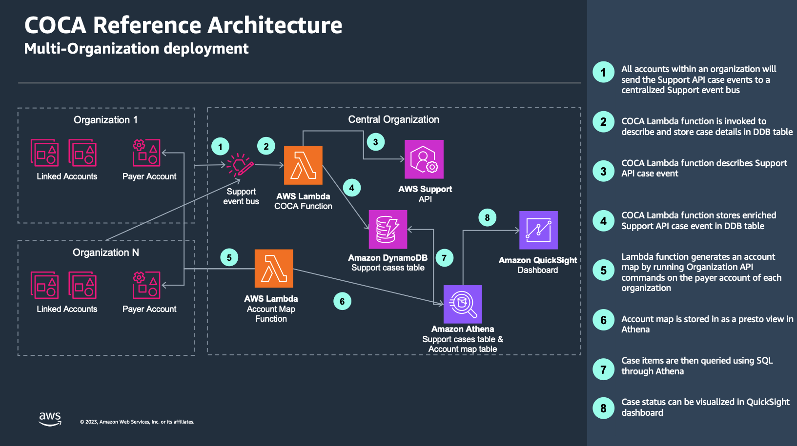

## Consolidated Organizations-wide Cases Activity

Consolidated Organizations-wide Case Activity (COCA) is a solution consisting in a data collection framework and a dashboard that allows customers to centrally monitor and extract insights from their case activity. The dashboard is hosted in QuickSight and the whole solution is made available as a set of CloudFormation templates. The dashboard provides visualisations for customer to quickly view cases by status, severity, AWS account, AWS service and such as top service code and top movers. Users of the solution are able to view the support cases for all accounts in their AWS Organization(s) in a single dashboard.

### Key features

* Centralized dataset and dashboard: This solution builds a central dataset of all cases activity for all AWS accounts. A dashboard is available to visualize the content of the dataset.

* Support for multiple Organizations: This solution can be used for multiple AWS Organizations. The dashboard provide controls to filter based on parent Organization, or Organizational Units.

* Ease of deployment: The whole solution can be deployed and updated with a CloudFormation stack. No need to run `awscli` commands or python scripts for deployment.

* Customizable import of historical data: This solution ships with a post deployment script allowing the import of historical data with a customizable lookback period (defaults to 120 days).

### Building blocks

This solution is built with AWS Support API, AWS Organizations API, Amazon EventBridge, AWS Lambda, Amazon Athena, Amazon QuickSight, Amazon DynamoDB.

## Reference Architectures

### Standard deployment

### Multi-Org deployment

### Deploying the solution

Find a step by step walkthrough in our [Deployment guide](./DEPLOYMENT.md).

## License

This project is licensed under the [Apache-2.0 License](./LICENSE).
